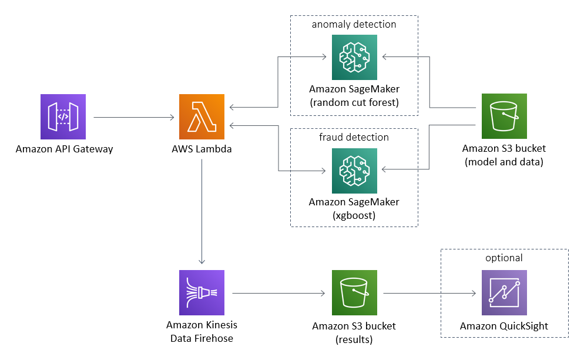

# Fraud Detection using Machine Learning

With businesses moving online, fraud and abuse in online systems is constantly increasing as well. Traditionally, rule-based fraud detection systems are used to combat online fraud, but these rely on a static set of rules created by human experts. This project uses machine learning to create models for fraud detection that are dynamic, self-improving and maintainable. Importantly, they can scale with the online business.

Specifically, we show how to use Amazon SageMaker to train supervised and unsupervised machine learning models on historical transactions, so that they can predict the likelihood of incoming transactions being fraudulent or not. We also show how to deploy the models, once trained, to a REST API that can be integrated into an existing business software infrastructure. This project includes a demonstration of this process using a public, anonymized credit card transactions [dataset provided by ULB](https://www.kaggle.com/mlg-ulb/creditcardfraud), but can be easily modified to work with custom labelled or unlaballed data provided as a relational table in csv format.

## Getting Started

You will need an AWS account to use this solution. Sign up for an account [here](https://aws.amazon.com/).

To run this JumpStart 1P Solution and have the infrastructure deploy to your AWS account you will need to create an active SageMaker Studio instance (see [Onboard to Amazon SageMaker Studio](https://docs.aws.amazon.com/sagemaker/latest/dg/gs-studio-onboard.html)). When your Studio instance is *Ready*, use the instructions in [SageMaker JumpStart](https://docs.aws.amazon.com/sagemaker/latest/dg/studio-jumpstart.html) to 1-Click Launch the solution.

The solution artifacts are included in this GitHub repository for reference.

*Note*: Solutions are available in most regions including us-west-2, and us-east-1.

**Caution**: Cloning this GitHub repository and running the code manually could lead to unexpected issues! Use the AWS CloudFormation template. You'll get an Amazon SageMaker Notebook instance that's been correctly setup and configured to access the other resources in the solution.

## Architecture

The project architecture deployed by the cloud formation template is shown here.

## Project Description
The project uses Amazon SageMaker to train both a supervised and an unsupervised machine learning models, which are then deployed using Amazon Sagemaker-managed endpoints.

If you have labels for your data, for example if some of the transactions have been annotated as fraudulent and some as legitimate, then you can train a supervised learning model to learn to discern the two classes. In this project, we provide a recipe to train a gradient boosted decision tree model using [XGBoost on Amazon SageMaker](https://docs.aws.amazon.com/sagemaker/latest/dg/xgboost.html). The supervised model training process also handles the common issue of working with highly imbalanced data in fraud detection problems. The project addresses this issue into two ways by 1) implementing data upsampling using the "imbalanced-learn" package, and 2) using scale position weight to control the balance of positive and negative weights.

If you don't have labelled data or if you want to augment your supervised model predictions with an anomaly score from an unsupervised model, then the project also trains a [RandomCutForest](https://docs.aws.amazon.com/sagemaker/latest/dg/randomcutforest.html) model using Amazon SageMaker. The RandomCutForest algorithm is trained on the entire dataset, without labels, and takes advantage of the highly imbalanced nature of fraud datasets, to predict higher anomaly scores for the fraudulent transactions in the dataset.

Both of the trained models are deployed to Amazon SageMaker managed real-time endpoints that host the models and can be invoked to provide model predictions for new transactions.

The model training and endpoint deployment is orchestrated by running a [jupyter notebook](source/notebooks/sagemaker_fraud_detection.ipynb) on a SageMaker Notebook instance. The jupyter notebook runs a demonstration of the project using the aforementioned anonymized credit card dataset that is automatically downloaded to the Amazon S3 Bucket created when you launch the solution. However, the notebook can be modified to run the project on a custom dataset in S3. The notebook instance also contains some example code that shows how to invoke the REST API for inference.

In order to encapsulate the project as a stand-alone microservice, Amazon API Gateway is used to provide a REST API, that is backed by an AWS Lambda function. The Lambda function runs the code necessary to preprocess incoming transactions, invoke sagemaker endpoints, merge results from both endpoints if necessary, store the model inputs and model predictions in S3 via Kinesis Firehose, and provide a response to the client.

## Data

The example dataset used in this solution was originally released as part of a research collaboration of Worldline and
the Machine Learning Group (http://mlg.ulb.ac.be) of ULB (Université Libre de Bruxelles) on big data mining and fraud
detection.

The dataset contains credit card transactions from European cardholders in 2013. As is common in fraud detection,
it is highly unbalanced, with 492 fraudulent transactions out of the 284,807 total transactions. The dataset contains
only numerical features, because the original features have been transformed for confidentiality using PCA. As a result,
the dataset contains 28 PCA components, and two features that haven't been transformed, _Amount_ and _Time_.
_Amount_ refers to the transaction amount, and _Time_ is the seconds elapsed between any transaction in the data
and the first transaction.

More details on current and past projects on related topics are available on
https://www.researchgate.net/project/Fraud-detection-5 and the page of the
[DefeatFraud](https://mlg.ulb.ac.be/wordpress/portfolio_page/defeatfraud-assessment-and-validation-of-deep-feature-engineering-and-learning-solutions-for-fraud-detection/) project

We cite the following works:
* Andrea Dal Pozzolo, Olivier Caelen, Reid A. Johnson and Gianluca Bontempi. Calibrating Probability with Undersampling for Unbalanced Classification. In Symposium on Computational Intelligence and Data Mining (CIDM), IEEE, 2015
* Dal Pozzolo, Andrea; Caelen, Olivier; Le Borgne, Yann-Ael; Waterschoot, Serge; Bontempi, Gianluca. Learned lessons in credit card fraud detection from a practitioner perspective, Expert systems with applications,41,10,4915-4928,2014, Pergamon
* Dal Pozzolo, Andrea; Boracchi, Giacomo; Caelen, Olivier; Alippi, Cesare; Bontempi, Gianluca. Credit card fraud detection: a realistic modeling and a novel learning strategy, IEEE transactions on neural networks and learning systems,29,8,3784-3797,2018,IEEE
* Dal Pozzolo, Andrea Adaptive Machine learning for credit card fraud detection ULB MLG PhD thesis (supervised by G. Bontempi)
* Carcillo, Fabrizio; Dal Pozzolo, Andrea; Le Borgne, Yann-Aël; Caelen, Olivier; Mazzer, Yannis; Bontempi, Gianluca. Scarff: a scalable framework for streaming credit card fraud detection with Spark, Information fusion,41, 182-194,2018,Elsevier
* Carcillo, Fabrizio; Le Borgne, Yann-Aël; Caelen, Olivier; Bontempi, Gianluca. Streaming active learning strategies for real-life credit card fraud detection: assessment and visualization, International Journal of Data Science and Analytics, 5,4,285-300,2018,Springer International Publishing

## Contents

* `deployment/`
  * `fraud-detection-using-machine-learning.yaml`: Creates AWS CloudFormation Stack for solution
* `source/`
  * `lambda`
    * `model-invocation/`
      * `index.py`: Lambda function script for invoking SageMaker endpoints for inference
  * `notebooks/`
    * `src`
      * `package`
        * `config.py`: Read in the environment variables set during the Amazon CloudFormation stack creation
        * `generate_endpoint_traffic.py`: Custom script to show how to send transaction traffic to REST API for inference
        * `util.py`: Helper function and utilities
    * `sagemaker_fraud_detection.ipynb`: Orchestrates the solution. Trains the models and deploys the trained model
    * `endpoint_demo.ipynb`: A small notebook that demonstrates how one can use the solution's endpoint to make prediction.
  * `scripts/`
    * `set_kernelspec.py`: Used to update the kernelspec name at deployment.
  * `test/`
    * Files that are used to automatically test the solution

## License

This project is licensed under the Apache-2.0 License.

